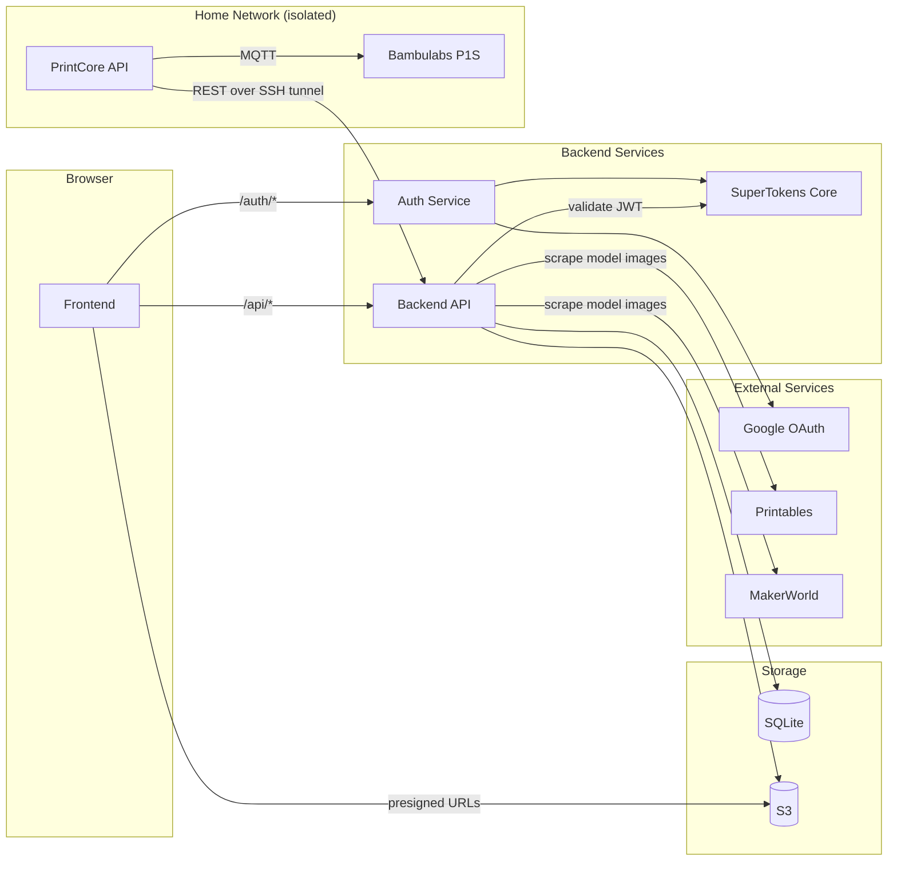

<h1 align="center">Print Flow</h1>

<p align="center">
    
</p>

## About

Print Flow is a 3D print queue management system that allows users to submit print requests, track their status, and enables administrators to manage the print queue. Built with a modern monorepo architecture using Bun, React 19, and SQLite.

## Environments
Dev: https://print.dev.ejoneid.dev  
Demo: https://print.demo.ejoneid.dev (Let's anyone test the full app without logging in. Mock data. Environment is reset every deployment)  
Prod: https://print.ejoneid.dev

## Architecture



## ⚠️ Requirements

- [Bun](https://bun.sh/) (v1.3.0 or higher)

## 🚀 Getting Started

1. Clone the repository
2. Create `.env` files.
   Each service requires its own '.env' file with environment variables.
   See the `example.env` files in each service for an example.
   To copy the example files, run the following command:
```bash
cp backend/example.env backend/.env &&
cp frontend/example.env frontend/.env &&
cp auth/example.env auth/.env
```
3. Install dependencies
```bash
bun install
```
4. Start the backend and frontend simultaneously in development mode
```bash
bun dev
```
